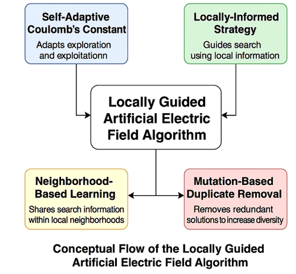
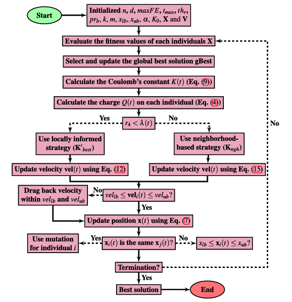
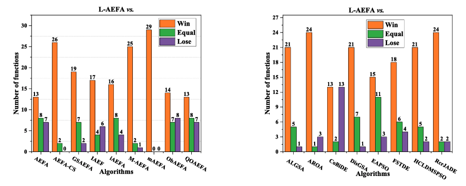

# L-AEFA
# L-AEFA — Self-adaptive & Locally-guided Artificial Electric Field Algorithm (MATLAB)

MATLAB implementation of **L-AEFA (Locally-guided Artificial Electric Field Algorithm)** from:

**Dikshit Chauhan, Shivani**  
*Self-adaptive and locally-guided artificial electric field algorithm for global optimization with aggregative learning*  
**Knowledge-Based Systems**, 325 (2025) 113835.  
DOI: **10.1016/j.knosys.2025.113835**

> AEFA is a physics-based metaheuristic inspired by electrostatics.  
> L-AEFA extends AEFA with **self-adaptive Coulomb’s constants**, **distance-index local guidance**, **neighborhood learning**, and **DE mutation** to improve exploration–exploitation and prevent premature convergence.

---

## Highlights (What’s new vs. AEFA)

L-AEFA introduces four core improvements:

1. **Self-adaptive Coulomb’s constant (per individual)**  
   Each agent has its own Coulomb constant that adapts using its **success/failure history** (aggregative learning).

2. **Locally-informed learning (distance-index guidance)**  
   Agents are arranged using **positional relationships** among the **historical best**, **current worst**, and other individuals to construct enhanced elite sets (e.g., **K′best**), strengthening the electrostatic force.

3. **Neighborhood-based learning**  
   A new neighbor set (**Kngh**) is constructed using the nearest individuals to reinforce local exploitation.

4. **DE/current-to-pbest/1 mutation for duplicate removal**  
   Duplicate individuals are replaced via DE mutation (instead of random reinitialization), improving diversity.

###
<p align="center">
  
</p>
<p align="center">
  <em><b>Figure 1.</b> Framework of L-AEFA.</em>
</p>

---

## What this repository provides

- MATLAB source code of L-AEFA optimizer (global optimization).
- Optional visualization utilities (convergence, diversity, and 2D search trajectory if enabled).
- Example scripts for running benchmarks/custom objective functions.

---

## Suggested repository layout

.
├── src/
│ ├── LAEFA.m # main algorithm (L-AEFA)
│ ├── Efield.m # electric field/acceleration components (a1,a2,a3)
│ ├── initialization.m # population & velocity init
│ ├── charge.m # charge computation
│ ├── Kconstant.m # self-adaptive Coulomb constant update
│ ├── Agg_move.m # velocity/position update + bounds
│ └── main_LAEFA.m # main run file
├── examples/
│ ├── main_LAEFA.m # compile it
├── figures/
│ ├── overview.png
│ ├── ablation.png
│ ├── convergence.png
│ └── diversity.png
├── CITATION.cff
├── LICENSE
└── README.md

---

## Requirements

- MATLAB R2018b+ (recommended)
- **Statistics and Machine Learning Toolbox** (if you use `pdist` / `squareform`)
- (Optional) toolboxes depending on your benchmarks/visualization scripts

---

## Quick start

### 1) Run main_LAEFA on a custom objective

Your code typically calls the objective as:
```matlab
fitness = feval(fhd, X', P_index);
```
### Example (Sphere, minimization):
```matlab
addpath(genpath("src"));

fhd = @(X, idx) sum(X.^2, 1);   % X: D×N → f: 1×N
P_index = 1;

N = 30;              % population
D = 10;              % dimension
max_it = 200;
max_fe = N * max_it;

ElitistCheck = 1;    % enable elite mechanism
min_flag = 1;        % 1 = minimize
Rpower = 1;

% self-adaptation / control knobs (use your paper settings here)
limit = 2; p = 0.5; k = 30; alpha = 10; K0 = 500;

[Fbest, BestChart] = LAEFA(fhd, N, D, max_it, max_fe, ...
    ElitistCheck, min_flag, Rpower, P_index, limit, p, k, alpha, K0);

fprintf("Best value = %.6e\n", Fbest);
```
---
## Algorithm overview (Implementation mapping)
### Main loop (LAEFA.m)

Typical flow:
1. Initialize positions/velocities
2. Evaluate fitness and update global best
3. Build distance index/neighbor sets
4. Update charges
5. Update self-adaptive Coulomb constants
6. Compute accelerations via multi-learning (local + neighbor + global-best pull)
7. Update velocities/positions and apply bounds
8. Remove duplicates using DE/current-to-pbest/1 mutation
9. Track convergence + diversity

### Electric field/acceleration (Efield.m)

#### Computes multiple acceleration components (e.g., a1,a2,a3) using:
1. elite (charge-based) guidance
2. distance-index guided individuals (K′best)
3. nearest-neighbor guidance (Kngh)

### Switching between learning strategies

#### A threshold parameter (often written as λ) can be used to switch between:
1. locally-informed strategy and
2. neighborhood-based strategy to maintain exploration/exploitation balance.

---
## Figures
### Overview
<p align="center">
  
</p>
<p align="center">
  <em><b>Figure 2.</b> The schematic procedure of the proposed L-AEFA.</em>
</p>

### Parameters' Nature
<p align="center">
  
</p>
<p align="center">
  <em><b>Figure 3.</b> Variation in self-adaptive Coulomb’s constant 𝐾 and 𝐾′ 𝑏𝑒𝑠𝑡 individuals with different values of their parameters.</em>
</p>

### Results
<p align="center">
  
</p>
<p align="center">
  <em><b>Figure 4.</b> The bar charts of average statistical results on which L-AEFA performs better (Win), similar (Equal), and worse (Lose) than others.</em>
</p>

---
## Citation
```bibtex
@article{Chauhan2025LAEFA,
  title   = {Self-adaptive and locally-guided artificial electric field algorithm for global optimization with aggregative learning},
  author  = {Chauhan, Dikshit and Shivani},
  journal = {Knowledge-Based Systems},
  volume  = {325},
  pages   = {113835},
  year    = {2025},
  doi     = {10.1016/j.knosys.2025.113835}
}
```
---
## Contact
Dikshit chauhan

Email: dikshitchauhan608@gmail.com

Issues and pull requests are welcome.

## Thanks
Co-author: Shivani
